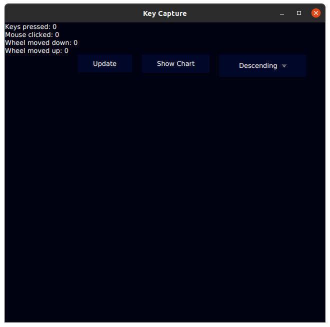
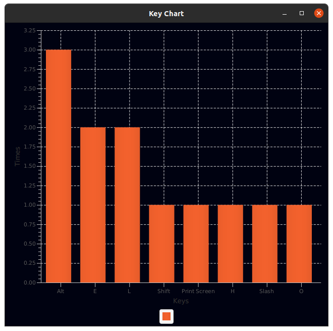

# Key Recorder
Key Recorder can record your keystrokes and mouse input and show you the statistics.
You can view a chart with the most common key presses.



## Downloading and Running
Download the latest release from the Releases page. Then, open a terminal at the directory of the
downloaded file and type:
```java -jar {jar-file}```
where `{jar-file}` is the jar file you downloaded.

## Chart
The chart shows you the most common key presses in descending order.
Changing the order is *not* supported yet and will be implemented in future releases.


